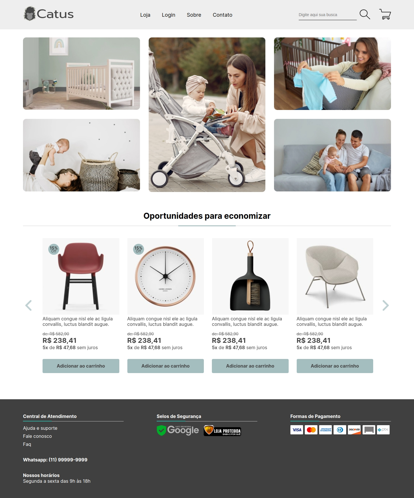
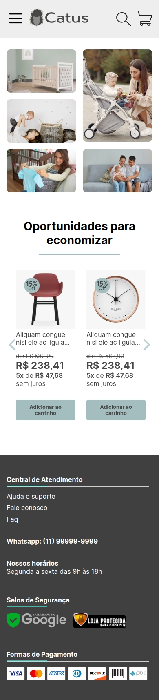

# Teste Front-end Catus

Este é um projeto de teste de front-end feito em HTML, CSS e JavaScript

[Clique aqui](https://eulucastiagolt.github.io/teste-catus) para ver o projeto ao vivo ou segue o link a baixo.

https://eulucastiagolt.github.io/teste-catus

### No projeto foram usado as seguintes tecnologis

* HTML Puro
* CSS com preprosseçador SASS/SCSS
* JavaScript
* Gulp.js
* Git
* Node.js
* PNPM
* Github
* Github pages

## Screenshots
| Desktop                            | Mobile                           |
|------------------------------------|----------------------------------|
|  |  |
